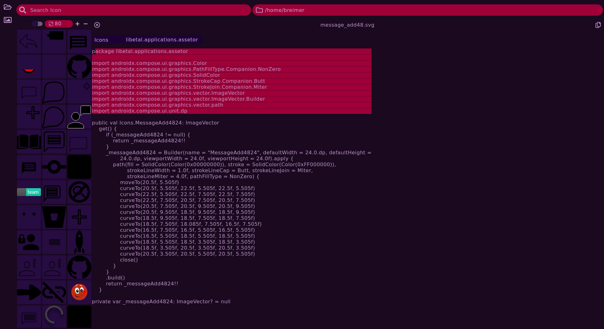
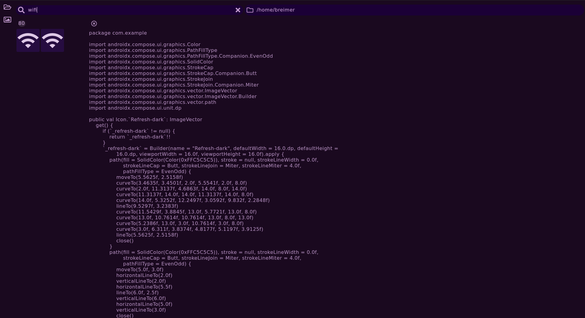
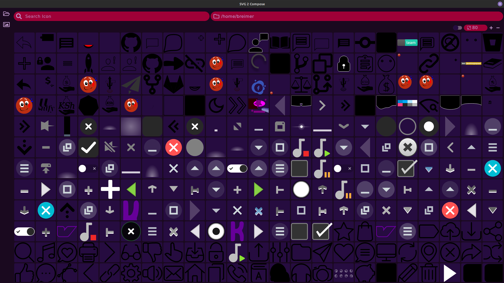

# Assetor

Base function is to convert svg to composable painter asstes. But the SvG2Compose does convert to Vector Drawable thus
having that as a feature will be done later or already has been done.

## Work in progress

1. Linux Mint Cinnamon

## Support

1. [x] Multiplatform
    1. [x] Linux 🔥
    2. [ ] Windows 🤣🤣
       ```Well can't game on linux at it's best you don't see me complain about it!!```
    3. [ ] Mac 🤣🤣🤣 ``` Well they can't game at all don't know```
2. [x] Buggy
    1. Less Buggy
    2. Search
        1. [x] At your own risk. (Just saying your pc might die). Actually improved this 😅
3. [ ] Load times.
   1. Fair enough depending on your directories sizes

## Workarounds

1. Be patient
2. Close and restart
3. Shut down your whole pc. Disconnect the from power. Shutdown mains and turn everything off it's over. 
4. Download new version ()

## Features

1. [x] Svg to Compose
2. [x] Multiplatform
    1. [x] Linux Buggy
    2. [ ] Not tested (Working on it but fixing base code first)
    3. [ ] Mac (Just no, for now!!)

## Installation

1. Download
    1. [x] [Dep File](assets/iconconverter_1.0.0-1_amd64.deb)
    2. [ ] [Windows File]()
    3. [ ] [MAC File]()

## Preview





See Works on my PC I don't know about yours 🤣🤣🤣🤣. Last one

## Dependencies

1. [ComposeNarrator](https://github.com/BreimerR/ComposeNarrator)
2. Compose-JB 1.1.1

<a href="https://www.paypal.com/donate/?hosted_button_id=CUHRL6CUYWRTA" target="_blank"></a>

/opt/Projects/Kotlin/ComposeIconsConverter